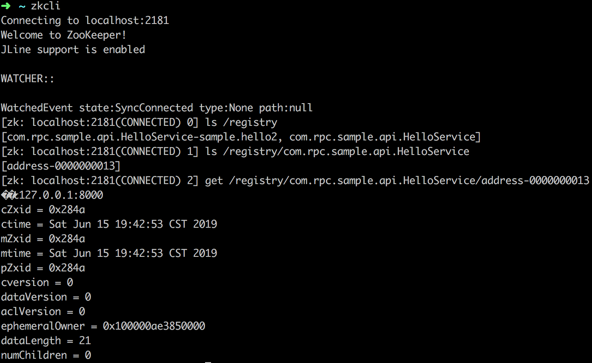
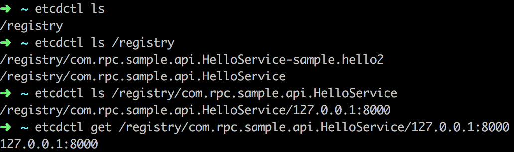

## Netty RPC框架

### 运行rpc-sample

1. 启动注册中心，etcd 或者zookeeper
2. 在rpc-sample-client、rpc-sample-server 的pom.xml中添加 rpc-registry-etcd 或者rpc-registry-zookeeper的依赖，修改`resources/spring.xml `引入对应的bean，修改`resources/rpc.properties`注册中心的地址
3. 启动server：`com.rpc.sample.server.RpcBootstrap`
4. 启动client：`com.rpc.sample.client.HelloClient`

### 主要参考

- 轻量级分布式RPC框架-黄勇：https://my.oschina.net/huangyong/blog/361751
- RPC框架几行代码就够了-梁飞：https://javatar.iteye.com/blog/1123915
- https://github.com/hu1991die/netty-rpc
- https://blog.csdn.net/arctan90/article/details/77835944

### 项目介绍

项目主要包含三个模块：client、server、registry。项目启动时，server向registry注册服务，client通过registry发现服务。

#### rpc-client

##### RpcClient.java

启动netty客户端，连接远程rpc-server，用于发送rpc请求，和接收响应。

##### RpcProxy.java

创建接口类的代理对象，在InvocationHandler的invoke方法里，实现请求的封装及发起。

#### rpc-registry

定义服务发现和服务注册的接口。具体实现有rpc-registry-etcd和rpc-registry-zookeeper

##### rpc-registry-zookeeper

1. 服务注册

通过定义临时节点来保存service地址

2. 服务发现

zookeeper的数据存储结构式树状的，所以可以直接通过 接口的全限定名这个父节点，获取所有子节点。

#####  rpc-registry-etcd

1. 服务注册

etcd是分布式的key-value存储。

这里使用的方式是

key: "/registry/com.rpc.sample.api.HelloService/127.0.0.1:8000"
value: "127.0.0.1:8080"

另外，etcd和zk不一样，没有临时节点，需要客户端自己来实现。通过定时刷新的方式来实现。

2. 服务发现

etcd虽然是key-value存储，但是实现了key有序排列，因此/a/b，/a/b/c，/a/b/d在存储中顺序排列的，实现父子目录关系。

#### rpc-server

##### RpcServer.java

启动netty server客户端

##### RpcServerHandler.java

Netty ChannelHandler ，处理接收到的客户端请求。

通过反射调用，执行client请求对应的方法，并将结果返回。

##### RpcService.java

定义 `@RpcService` 注解。

`RpcServer.java` bean加载后，会扫描有 `@RpcService` 注解的类，即服务，并注册到 registry。

#### rpc-common

定义一些通用结构，如rpc request/response，netty编解码方式。
